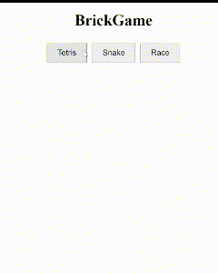

# BrickGame

**BrickGame** — это мультиплатформенный проект, реализующий несколько классических игр с использованием различных технологий и интерфейсов. В проекте представлены игры: **Tetris** (на C), **Snake** (на C++) и **Race** (на Python). Каждая игра может быть отображена через три интерфейса: CLI (на базе ncurses), Desktop (Qt) и Web (JS, HTML, CSS). 

## Функциональность

- **Игры:**
  - **Tetris** — реализован на C.
  - **Snake** — реализован на C++.
  - **Race** — реализован на Python.
- **Интерфейсы:**
  - **CLI (Command-Line Interface):** текстовый интерфейс с использованием библиотеки ncurses.
  - **Desktop GUI:** графический интерфейс с использованием Qt.
  - **Web Interface:** веб-интерфейс с использованием HTML, CSS и JavaScript.
- **Сервер:**
  - Реализован на Python с использованием FastAPI.
  - Предоставляет REST API для взаимодействия с клиентами.
- **Клиентская библиотека:**
  - Написана на C++ с использованием libcurl и nlohmann/json.
  - Позволяет интегрировать функционал сервера в CLI и Desktop интерфейсы.

---

## Сборка и запуск

### Зависимости

Для успешной сборки и запуска вам потребуется:
- **Компиляторы:** `gcc`, `g++`
- **Библиотеки:** `ncurses`, `Qt`, `libcurl`, `nlohmann/json`
- **Инструменты:** `cmake`, `make`
- **Python:** установленный Python 3 с пакетом `coverage`
- **FastAPI:** для серверной части

### Команды Makefile

- **Сборка и запуск тестов:**
  ```bash
  make tests
- **Перед каждой сборкой стоит:**
  ```bash
  make clean
- **Сборка и запуск cli:**
  ```bash
  make libtetris libsnake librace_client cli_gui
  make run_server
  make run_cli

- **Сборка и запуск desktop:**
  ```bash
  make libtetris libsnake librace_client desktop_gui
  make run_server
  make run_desktop

- **Сборка и запуск web:**
  ```bash
  make libtetris libsnake cli_gui
  make run_server
  перейти по localhost:8080



